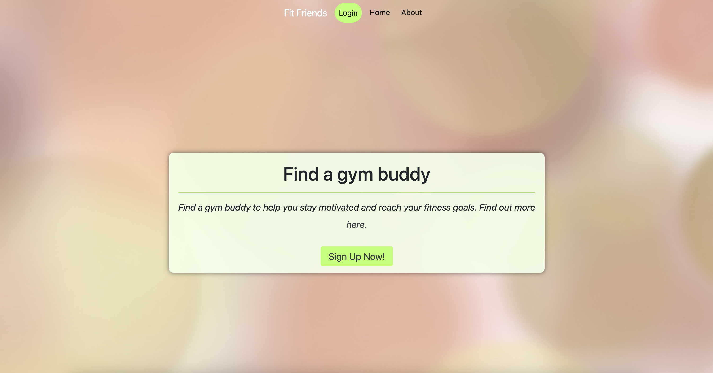
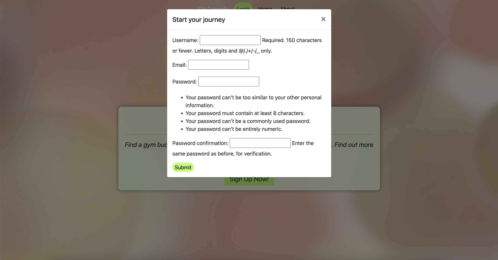
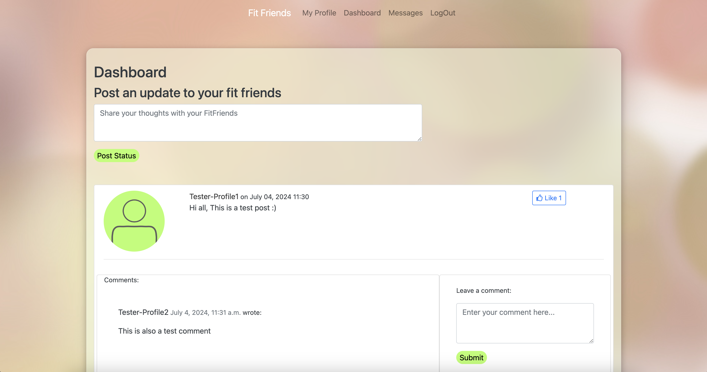
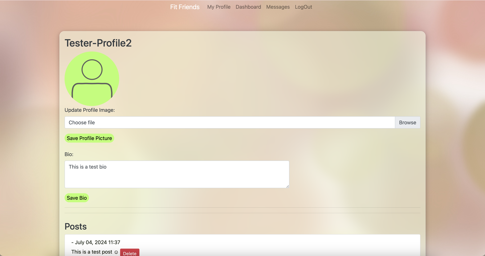
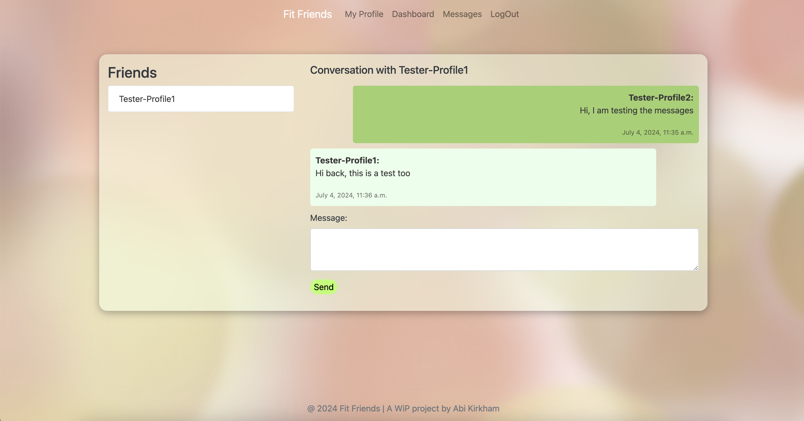
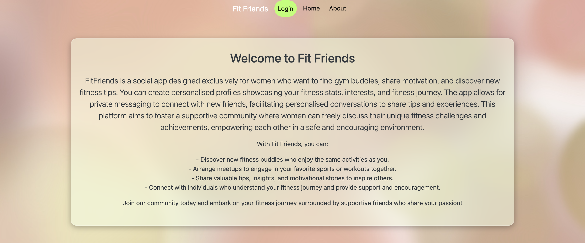
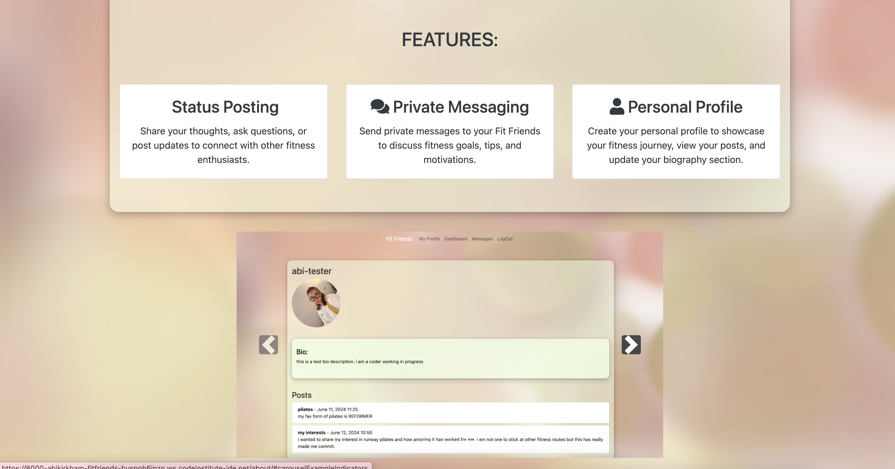

# FitFriends


## Purpose

This is a social app designed exclusively for women who want to find gym buddies, share motivation, and discover new fitness tips. Users can create personalized profiles showcasing their fitness stats, interests, and fitness journey. The app allows for private messaging to connect with new friends, facilitating personalized conversations to share tips and experiences. This platform aims to foster a supportive community where women can freely discuss their unique fitness challenges and achievements, empowering each other in a safe and encouraging environment.

## User Stories

1. **Authorization**
   - As a user, I can log in and log out of the site which ensures my account is secure and provides access to personalized features.

2. **Profiles**
   - As a user, I can create and edit my profile which displays and updates my personal information and activities.

3. **Add Friends**
   - As a user, I can add friends who have the same interests which allows me to connect with or remove connections with other users.

4. **Post Updates**
   - As a user, I can post my thoughts and activities with everyone on the site which allows me to find new friends with similar interests.

5. **Comment**
   - As a user, I can comment on others posts which allows me to interact with and manage my contributions to my friends' posts.

6. **Like**
   - As a user, I can like and unlike updates which shows or removes my appreciation for my friends' posts.

7. **Private Message**
   - As a user, I can send and receive private messages which allows me to communicate directly and privately with other users.


## Wireframes


## Flow chart 


Using: [Lucidchart Flowchart](https://lucid.app/lucidspark/9fbfecbb-4dd1-4c0a-8630-f0a85bd5505f/edit?beaconFlowId=644738E63C273F37&invitationId=inv_6a141c5b-80a3-42e5-890c-93dc1ef500d8&page=0_0)


## Technologies Used

This project utilises a variety of technologies to build, style, and deploy the application. Below is a brief description of each technology used to build my project.

### HTML (HyperText Markup Language)
- [HTML](https://en.wikipedia.org/wiki/HTML)
- **Description:** HTML is the standard markup language used to create the web pages used. It provides the structure of the webpages, allowing the inclusion of text, images, links, and other multimedia.

### CSS (Cascading Style Sheets)
- [CSS](https://en.wikipedia.org/wiki/CSS)
- **Description:** CSS is a stylesheet language used for ensuring my project had more personalised design on top of Bootstrap. It allows for the separation of content and design, enabling the styling of web pages with colors, layouts, and fonts.

### JavaScript
- [JavaScript](https://en.wikipedia.org/wiki/JavaScript)
- **Description:** JavaScript is a programming language commonly used to create interactive effects within web browsers. For this project and the features I desired to create, I used JQuery with AJAX, frameworks and libarys of Javascript, to ensure the best interaction for the users. 

### Django
- [Django](https://en.wikipedia.org/wiki/Django_(web_framework))
- **Description:** As this project is soley targetted around being a Django project, this is the main framework used to ensure faster development and clean, pragmatic design. It is known for its robust feature set, including an ORM, authentication, and an admin interface, needed for this social media site.

### Bootstrap
- [Bootstrap](https://en.wikipedia.org/wiki/Bootstrap_(front-end_framework))
- **Description:** Bootstrap is a popular front-end framework for developing responsive and mobile-first websites. It includes pre-designed CSS and JavaScript components that make it easier to build web pages quickly and consistently. I decided to use this for the base design of my project to ensure consistancy and a clean layout.

### Heroku
- [Heroku](https://en.wikipedia.org/wiki/Heroku)
- **Description:** Heroku is the cloud platform as a service used todeploy my project and have a platform which could support my multiple programming languages and is known for its ease of use and scalability.

### Neon
- [Neon](https://en.wikipedia.org/wiki/Neon_(software))
- **Description:** Neon was the chosedcloud-native serverless PostgreSQL provider used, as advised from code Institute to use ElephantSQL, however these were no longer availible for me to use as they are no longer accepting users. Neon offers scalable and reliable database services and this was ideal for my project. 

### WhiteNoise
- [WhiteNoise](https://github.com/evansd/whitenoise)
- **Description:** Initaially I used Cloudinary (below) as my service for maintaining my images on the site however, it is explain int the issues section, I had errors with this and was then advised to change to Whitenoise. WhiteNoise is a Python library used with Django to serve static files efficiently. It simplifies static file management by integrating seamlessly with Django's staticfiles app and improving performance through compression and caching.

### Cloudinary
- [Cloudinary](https://en.wikipedia.org/wiki/Cloudinary)
- **Description:** Cloudinary is a cloud-based service that provides an end-to-end solution for managing images and videos. It offers functionalities such as upload, storage, transformation, and delivery, optimising media content for web and mobile applications. (See error which occured in the issues section).


## Setup

### DJANGO

1. **Install Django** :
pip install django

2. **Create a Django project** :
django-admin startproject myproject
cd myproject


### NEON

1. **Install Neon**:
pip install neon


2. **Setup Neon**:
- Create a `neon_settings.py` file in your Django project directory.
- Configure your settings in this file using Neon's syntax for environment-based configuration. For example:
  ```python
  from neon import settings

  settings.configure(
      DEBUG=True,
      DATABASES={
          'default': {
              'ENGINE': 'django.db.backends.sqlite3',
              'NAME': 'mydatabase',
          }
      },
      # Add other settings as needed
  )
  ```

3. **Integrate Neon with Django settings**:
Modify your `settings.py` to load settings from `neon_settings.py`:
```python
# settings.py
from neon.contrib.django import get_neon_settings

neon_settings = get_neon_settings()
if neon_settings:
    locals().update(neon_settings)
```

### Whitenoise
1. **Install Whitenoise**:

pip install whitenoise

2. **Configure Whitenoise**:

Add 'whitenoise.middleware.WhiteNoiseMiddleware', to the MIDDLEWARE list in your settings.py:

```python
MIDDLEWARE = [
    # Other middleware classes
    'whitenoise.middleware.WhiteNoiseMiddleware',
]
```
3. **Configure static file handling in settings.py**:

```python
STATIC_URL = '/static/'
STATIC_ROOT = os.path.join(BASE_DIR, 'staticfiles')

STATICFILES_STORAGE = 'whitenoise.storage.CompressedManifestStaticFilesStorage'
```

4. **Final Steps**
Collect static files:

python manage.py collectstatic
Run migrations:

python manage.py migrate
Start the Django development server:

python manage.py runserver


## Deployment 

### Making a Local Clone to create project

- Find the GitHub Repository.
- Click the Code button
- Copy the link shown.
- In Gitpod, change the directory to the location you would like the cloned directory to be located.
- Type git clone, and paste the link you copied in step 3.
- Press Enter to have the local clone created.

### Updating my changes

git add <file> - This command was used to add the file(s) to the staging area before they are committed.

git commit -m “commit message” - This command was used to commit changes to the local repository queue ready for the final step.

git push - This command was used to update all committed code to the remote repository on github.

### Heroku

Deploying to Heroku steps ....

include config vars....

## Features 

- HOME



- USER AUTH / LOGIN / SIGN UP




- DASHBOARD



- PROFILE



- MESSAGES



- ABOUT






## Testing

#### HTML

<details>
<summary>Click to expand.</summary>

- About.html


- Dashboard.html


- Login.html


- Logout.html


- Messages.html


- Profile.html


- Register.html

</details>

#### CSS

<details>
<summary>Click to expand.</summary>

- About.html


- Dashboard.html


- Login.html


- Logout.html


- Messages.html


- Profile.html


- Register.html


</details>

#### JAVASCRIPT

<details>
<summary>Click to expand.</summary>

</details>

#### DJANGO

<details>
<summary>Click to expand.</summary>

</details>

### Responsiveness 

<details>
<summary>Click to expand.</summary>

- About.html


- Dashboard.html


- Login.html


- Logout.html


- Messages.html


- Profile.html


- Register.html


</details>

### Compatibilty 

The project has been tested for compatibility with the following browsers using this site. Unfortunately the trail on my account would not cover macOS which is why the images may look different:

- Google Chrome (Version 122)
- Edge (Version 122)
- Firefox (Version 124)
- Opera (Version 108)
- macOS Sonoma 16.5

Below are the images shown to prove these tests.

<details>
<summary>Click to expand.</summary>

</details>

### Accessibility

By utilising the Wave Accessibility tool for ongoing development and final testing, used for the below:

1. Ensure all forms have associated labels or appropriate aria-labels.
2. Validate that color contrasts meet the minimum ratios outlined in WCAG 2.1 Contrast Guidelines.
3. Verify correct heading levels to accurately convey content importance.
4. Confirm content is organized within landmarks for ease of use with assistive technology.
5. Provide alternative text or titles for non-textual content.
6. Set the HTML page lang attribute.
7. Implement Aria properties in adherence to best practices outlined in WCAG 2.1.
8. Follow established coding best practices for WCAG 2.1.


### Manual Testing 

| Function | User Action | Outcome | Result |
|----------|-------------|---------|--------|

### Scenario One - Correct Inputs for Register

include missed fields and incorrect inputs 

### Scenario Two - Correct Inputs for Login

### Scenario Three - Correct Inputs for Messages

### Scenario Four - Correct Inputs for Profile Pic Upload

### Scenario Five - Correct Inputs for Posting a Status

## Issues

- intial issues with static files from cloudinary - look back on code insitute tutor chat 

## Credits
- [WireFrames](https://cacoo.com/diagrams/QXSJF7qPDCKNuzVk/B4F94?reload_rt=1718100120618_1&)
- [Base project for a social network site](https://realpython.com/django-social-network-1/)
