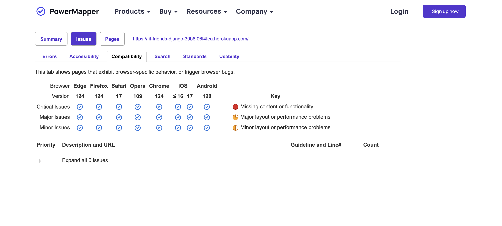

# FitFriends


## Purpose

This is a social app designed exclusively for women who want to find gym buddies, share motivation, and discover new fitness tips. Users can create personalized profiles showcasing their fitness stats, interests, and fitness journey. The app allows for private messaging to connect with new friends, facilitating personalized conversations to share tips and experiences. This platform aims to foster a supportive community where women can freely discuss their unique fitness challenges and achievements, empowering each other in a safe and encouraging environment.

## User Stories

1. **Authorization**
   - As a user, I can log in and log out of the site which ensures my account is secure and provides access to personalized features.

2. **Profiles**
   - As a user, I can create and edit my profile which displays and updates my personal information and activities.

3. **Add Friends**
   - As a user, I can add friends who have the same interests which allows me to connect with or remove connections with other users.

4. **Post Updates**
   - As a user, I can post my thoughts and activities with everyone on the site which allows me to find new friends with similar interests.

5. **Comment**
   - As a user, I can comment on others posts which allows me to interact with and manage my contributions to my friends' posts.

6. **Like**
   - As a user, I can like and unlike updates which shows or removes my appreciation for my friends' posts.

7. **Private Message**
   - As a user, I can send and receive private messages which allows me to communicate directly and privately with other users.


## Wireframes


## Flow chart 


Using: [Lucidchart Flowchart](https://lucid.app/lucidspark/9fbfecbb-4dd1-4c0a-8630-f0a85bd5505f/edit?beaconFlowId=644738E63C273F37&invitationId=inv_6a141c5b-80a3-42e5-890c-93dc1ef500d8&page=0_0)


## Technologies Used

This project utilises a variety of technologies to build, style, and deploy the application. Below is a brief description of each technology used to build my project.

### HTML (HyperText Markup Language)
- [HTML](https://en.wikipedia.org/wiki/HTML)
- **Description:** HTML is the standard markup language used to create the web pages used. It provides the structure of the webpages, allowing the inclusion of text, images, links, and other multimedia.

### CSS (Cascading Style Sheets)
- [CSS](https://en.wikipedia.org/wiki/CSS)
- **Description:** CSS is a stylesheet language used for ensuring my project had more personalised design on top of Bootstrap. It allows for the separation of content and design, enabling the styling of web pages with colors, layouts, and fonts.

### JavaScript
- [JavaScript](https://en.wikipedia.org/wiki/JavaScript)
- **Description:** JavaScript is a programming language commonly used to create interactive effects within web browsers. For this project and the features I desired to create, I used JQuery with AJAX, frameworks and libarys of Javascript, to ensure the best interaction for the users. 

### Django
- [Django](https://en.wikipedia.org/wiki/Django_(web_framework))
- **Description:** As this project is soley targetted around being a Django project, this is the main framework used to ensure faster development and clean, pragmatic design. It is known for its robust feature set, including an ORM, authentication, and an admin interface, needed for this social media site.

### Bootstrap
- [Bootstrap](https://en.wikipedia.org/wiki/Bootstrap_(front-end_framework))
- **Description:** Bootstrap is a popular front-end framework for developing responsive and mobile-first websites. It includes pre-designed CSS and JavaScript components that make it easier to build web pages quickly and consistently. I decided to use this for the base design of my project to ensure consistancy and a clean layout.

### Heroku
- [Heroku](https://en.wikipedia.org/wiki/Heroku)
- **Description:** Heroku is the cloud platform as a service used todeploy my project and have a platform which could support my multiple programming languages and is known for its ease of use and scalability.

### Neon
- [Neon](https://en.wikipedia.org/wiki/Neon_(software))
- **Description:** Neon was the chosedcloud-native serverless PostgreSQL provider used, as advised from code Institute to use ElephantSQL, however these were no longer availible for me to use as they are no longer accepting users. Neon offers scalable and reliable database services and this was ideal for my project. 

### WhiteNoise
- [WhiteNoise](https://github.com/evansd/whitenoise)
- **Description:** Initaially I used Cloudinary (below) as my service for maintaining my images on the site however, it is explain int the issues section, I had errors with this and was then advised to change to Whitenoise. WhiteNoise is a Python library used with Django to serve static files efficiently. It simplifies static file management by integrating seamlessly with Django's staticfiles app and improving performance through compression and caching.

### Cloudinary
- [Cloudinary](https://en.wikipedia.org/wiki/Cloudinary)
- **Description:** Cloudinary is a cloud-based service that provides an end-to-end solution for managing images and videos. It offers functionalities such as upload, storage, transformation, and delivery, optimising media content for web and mobile applications. (See error which occured in the issues section).


## Setup

### DJANGO

1. **Install Django** :
pip install django

2. **Create a Django project** :
django-admin startproject myproject
cd myproject


### NEON

1. **Install Neon**:
pip install neon


2. **Setup Neon**:
- Create a `settings.py` file in your Django project directory.
- Configure your settings to connect to your env.py file which will hold Neon's syntax for environment-based configuration. For example:

settings.py
  ```python
  if os.path.isfile('env.py'):
    import env
  ```
env.py
```python
    import os
        os.environ['DATABASE_URL'] = '<Database-URL>'
        os.environ["SECRET_KEY"]="<create_your_secret_key>"
```

### Whitenoise
1. **Install Whitenoise**:

pip install whitenoise

2. **Configure Whitenoise**:

Add 'whitenoise.middleware.WhiteNoiseMiddleware', to the MIDDLEWARE list in your settings.py:

```python
MIDDLEWARE = [
    # Other middleware classes
    'whitenoise.middleware.WhiteNoiseMiddleware',
]
```
3. **Configure static file handling in settings.py**:

```python
STATIC_URL = '/static/'
STATIC_ROOT = os.path.join(BASE_DIR, 'staticfiles')

```

4. **Final Steps**
Collect static files:

python manage.py collectstatic
Run migrations:

python manage.py migrate
Start the Django development server:

python manage.py runserver


## Deployment 

### Making a Local Clone to create project

- Find the GitHub Repository.
- Click the Code button
- Copy the link shown.
- In Gitpod, change the directory to the location you would like the cloned directory to be located.
- Type git clone, and paste the link you copied in step 3.
- Press Enter to have the local clone created.

### Updating my changes

git add <file> - This command was used to add the file(s) to the staging area before they are committed.

git commit -m “commit message” - This command was used to commit changes to the local repository queue ready for the final step.

git push - This command was used to update all committed code to the remote repository on github.

### Heroku


#### 1. Prepare Your Project

Ensure your project has the necessary files for deployment:

- **Procfile**: Specifies the commands that are executed by the app on startup.
    ```makefile
  python app.py 
  ```
- **requirements.txt**: Lists all the dependencies your app needs.
    ```makefile
  Flask==1.1.2
  gunicorn==20.0.4
  ```

#### 2. Create a New Heroku App
Open your terminal and log in to Heroku:

```
bash:
heroku login
Create a new app:

bash:
heroku create your-app-name
```

Alternatively, create an app directly from the Heroku dashboard by clicking "New" and then "Create new app".

#### 3. Connect Heroku App to GitHub
- Go to Heroku Dashboard: Navigate to the Heroku dashboard.
- Select Your App: Click on the app you created.
- Deploy Tab: Go to the "Deploy" tab.
- Deployment Method: Under "Deployment method", select "GitHub".
- Connect to GitHub: Authorize Heroku to access your - GitHub account if it's your first time. Search for the repository you want to connect and click "Connect".

#### 4. Configure Environment Variables
Set any necessary environment variables for your app:

Go to the "Settings" tab.
Click "Reveal Config Vars".
Add your key-value pairs.

#### 5. Manual Deployment
In the "Deploy" tab:

Go to the "Manual deploy" section.
Select the branch you want to deploy.
Click "Deploy Branch".

## Features 

- HOME 
    - The landing page for the site. Users can sign up or log in from here. If a user is already logged in, they will have access to their personal pages. This page is not accessible to users who are not logged in.


- USER AUTH / LOGIN / SIGN UP 
    - Utilises Django's user authentication system to allow users to create an account and log in. This provides each user with a personal account.


- DASHBOARD 
    - The main page for logged-in users. It displays all user comments, allowing interaction with posts, comments, and likes.


- PROFILE
    - A user profile is created upon logging in using Django. It includes an automatic profile picture and displays the user's own posts. Users can delete posts and manage their friends list here.


- MESSAGES
    - A direct messaging platform where users can message their friends. Only people on the user's friends list can be messaged.


- ABOUT
    - This page is visible only when not logged in. It provides potential users with more information about the site and a visual representation of the user experience.


## Testing

#### HTML

<details>
<summary>Click to expand.</summary>

- About.html


- Dashboard.html


- Login.html


- Logout.html


- Messages.html


- Profile.html


- Register.html

</details>

#### CSS

<details>
<summary>Click to expand.</summary>

- About.html


- Dashboard.html


- Login.html


- Logout.html


- Messages.html


- Profile.html


- Register.html


</details>

#### JAVASCRIPT

<details>
<summary>Click to expand.</summary>

- JShint


</details>


### Responsiveness 

<details>
<summary>Click to expand.</summary>

- About.html


- Dashboard.html


- Login.html


- Messages.html


- Profile.html


- Register.html


</details>

### Compatibilty 

The project has been tested for compatibility with the following browsers using this site. You will be able to see there are no issues with the compatability across these browsers:

- Google Chrome (Version 124)
- Edge (Version 124)
- Firefox (Version 124)
- Opera (Version 109)
- macOS Sonoma (17)
- Chrome (124)
- iOS (<= 16 17)



### Accessibility

By utilising the Wave Accessibility tool for ongoing development and final testing, used for the below:

1. Ensure all forms have associated labels or appropriate aria-labels.
2. Validate that color contrasts meet the minimum ratios outlined in WCAG 2.1 Contrast Guidelines.
3. Verify correct heading levels to accurately convey content importance.
4. Confirm content is organized within landmarks for ease of use with assistive technology.
5. Provide alternative text or titles for non-textual content.
6. Set the HTML page lang attribute.
7. Implement Aria properties in adherence to best practices outlined in WCAG 2.1.
8. Follow established coding best practices for WCAG 2.1.


### Manual Testing 

| Function | User Action | Outcome | Result |
|----------|-------------|---------|--------|
| Load page: Register | Access FitFriends link | The landing page will open, showing an active navigation system, signup modal and css/bootstrap styles. The background image will display. | Pass |
| Load page: About | From home page, access about link in navigation or in callout container | The about page will display 3 containers with content about the site, features held and a image carosel to show use of django use. All images and css styles loading as should with active navigation sytem. | Pass |
| Load page: Login | From home page, access the login link in the navigation | The login page simply has a active username and password text feild which working with this django project stores the users authetication details. | Pass |
| Load page: Dashboard | Once logged in with correct credentials, this should bring user to dashboard.html | The dashboard will present every users posts on the site. For each post will persent the users name and profile image, their post content and the ability to interact by liking or commenting on the post. | Pass |
| Load page: Profile | Once logged in with correct credentials opened on to your account, you can access profile from here | This profile is created when the user signs up, it will load their default profile image or already uploaded image, their bio short desription, the posts they have made posting on the dashboard and the other users they have followed. | Pass |
| Load page: Messages | Once logged in with correct credentials opened on to your account, you can access messages from here | Initailly when opening this page, this willl show the logged in users friend list (as you can only start a chat with friends). When a friend is selected, their conversation with any previous messages shown. Also the ability to send live messages. | Pass |
| Load page: Logout | Once logged in with correct credentials opened on to your account, you can logout from here | When the logout button in the navigation is pressed, this will log the user out and redirect them to the login page, with the navigation when user not logged in. | Pass |
| Sign up modal | Access FitFriends link, select the "Sign up now!" buttom for sign up modal to appear |  | Pass |
| Like post | Once logged in with correct credentials, on the dashboard you can see all account holders posts where you can interact by liking posts |  | Pass |
| Comment on post | Once logged in with correct credentials, on the dashboard you can see all account holders posts where you can interact by commenting on posts |  | Pass |
| Post a Status | Once logged in with correct credentials, you can post your personalised status on the dashboard for everyone to see |  | Pass |
| Another user profile | Once logged in with correct credentials, from the dashoard you will be able to see all users, if you like the posts and want to find out more about them, you can click on their name which will bring up there profile |  | Pass |
| Upload profile picture | Once logged in with correct credentials, you can access your personal profile and upload your own picture with the upload button |  | Pass |
| Update personal status | Once logged in with correct credentials, you can access your personal profile and add a personal statement about you/ explaining your profile |  | Pass |
| View friends | Once logged in with correct credentials, on you profile page you will be able to see your friends you have followed |  | Pass |
| Delete posts | Once logged in with correct credentials, on you profile page you will be able to view all posts on the dashboard and have the option to delete these |  | Pass |
| Select friend to have conversation with | Once logged in with correct credentials, on the messages page you will see a list of all your friends to message |  | Pass |
| Send a message | Once logged in with correct credentials, on the messages page after selecting a friend to have a conversation with you will see a text feild where you can type and send your private message |  | Pass |


### Form Testing

The site was tested for both correct and incorrect inputs for user interactions, covering various scenarios.

#### Scenario One 
 ##### Step One - Correct Inputs

**Steps to test:**

1. Navigate to FitFriends - Home Page
2. Select the sign up modal form and input the following data:
   - User Name: Jane
   - Email: doe.jane@test.com
   - Password: This1is2a3test
   - Repeate password: This1is2a3test
3. Click Submit
4. User should be redirected to `login.html` confirmation page. This function will have created and individual profile for the user.

**Expected:**

Form submits with no warnings or errors, and the user is redirected to `login.html` confirmation page.

**Actual:**

The website behaved as expected with no errors or warnings and redirected to `login.html`.

#### Part Two - Missing Required Field User Name

**Steps to test:**

1. Navigate to FitFriends - Home Page
2. Scroll down to the form and input the following data:
   - First Name:
   - Email: doe.jane@test.com
   - Password: This1is2a3test
   - Repeate password: This1is2a3test
3. Click Submit

**Expected:**

The form does not submit, and an error is displayed to tell the user that the field is required.

**Actual:**

The website behaved as expected; an error message was displayed, and the form did not submit.


#### Part Three - Missing Required Field Email

**Steps to test:**

1. Navigate to FitFriends - Home Page
2. Scroll down to the form and input the following data:
   - User Name: Jane
   - Email:
   - Password: This1is2a3test
   - Repeate password: This1is2a3test
3. Click Submit

**Expected:**

The form does not submit, and an error is displayed to tell the user that the field is required.

**Actual:**

The website behaved as expected; an error message was displayed, and the form did not submit.<


#### Part Four - Incorrect email format

**Steps to test:**

1. Navigate to FitFriends - Home Page
2. Scroll down to the form and input the following data:
   - User Name: Jane
   - Email: doe.janetest.com
   - Password: This1is2a3test
   - Repeate password: This1is2a3test
3. Click Submit

**Expected:**

The form does not submit, and an error is displayed to tell the user that a valid email is required and the format it should be in.

**Actual:**

The website behaved as expected; an error message was displayed, and the form did not submit. 


## Scenario One - Correct Inputs

### Part One - Correct Inputs

**Steps to test:**

1. Navigate to FitFriends - Home Page
2. Select the sign-up modal form and input the following data:
   - User Name: Jane
   - Email: doe.jane@test.com
   - Password: This1is2a3test
   - Repeat password: This1is2a3test
3. Click Submit
4. User should be redirected to `login.html` confirmation page. This function will have created an individual profile for the user.

**Expected:**

Form submits with no warnings or errors, and the user is redirected to `login.html` confirmation page.

**Actual:**

The website behaved as expected with no errors or warnings and redirected to `login.html`.

### Part Two - Missing Required Field User Name

**Steps to test:**

1. Navigate to FitFriends - Home Page
2. Scroll down to the form and input the following data:
   - User Name:
   - Email: doe.jane@test.com
   - Password: This1is2a3test
   - Repeat password: This1is2a3test
3. Click Submit

**Expected:**

The form does not submit, and an error is displayed to tell the user that the field is required.

**Actual:**

The website behaved as expected; an error message was displayed, and the form did not submit.


### Part Three - Missing Required Field Email

**Steps to test:**

1. Navigate to FitFriends - Home Page
2. Scroll down to the form and input the following data:
   - User Name: Jane
   - Email:
   - Password: This1is2a3test
   - Repeat password: This1is2a3test
3. Click Submit

**Expected:**

The form does not submit, and an error is displayed to tell the user that the field is required.

**Actual:**

The website behaved as expected; an error message was displayed, and the form did not submit.


### Part Four - Incorrect Email Format

**Steps to test:**

1. Navigate to FitFriends - Home Page
2. Scroll down to the form and input the following data:
   - User Name: Jane
   - Email: doe.janetest.com
   - Password: This1is2a3test
   - Repeat password: This1is2a3test
3. Click Submit

**Expected:**

The form does not submit, and an error is displayed to tell the user that a valid email is required and the format it should be in.

**Actual:**

The website behaved as expected; an error message was displayed, and the form did not submit.


## Scenario Two - Correct Inputs for Login

### Part One - Correct Inputs

**Steps to test:**

1. Navigate to FitFriends - Home Page
2. Select the login modal form and input the following data:
   - User Name: Jane
   - Password: This1is2a3test
3. Click Submit
4. User should be redirected to `dashboard.html` page. This function will log the user into their individual profile.

**Expected:**

Form submits with no warnings or errors, and the user is redirected to `dashboard.html` page.

**Actual:**

The website behaved as expected with no errors or warnings and redirected to `dashboard.html`.

### Part Two - Missing Required Field User Name

**Steps to test:**

1. Navigate to FitFriends - Home Page
2. Select the login modal form and input the following data:
   - User Name:
   - Password: This1is2a3test
3. Click Submit

**Expected:**

The form does not submit, and an error is displayed to tell the user that the field is required.

**Actual:**

The website behaved as expected; an error message was displayed, and the form did not submit.


### Part Three - Missing Required Field Password

**Steps to test:**

1. Navigate to FitFriends - Home Page
2. Select the login modal form and input the following data:
   - User Name: Jane
   - Password:
3. Click Submit

**Expected:**

The form does not submit, and an error is displayed to tell the user that the field is required.

**Actual:**

The website behaved as expected; an error message was displayed, and the form did not submit.


## Scenario Three - Correct Inputs for Messages

### Part One - Correct Inputs

**Steps to test:**

1. Navigate to FitFriends - Home Page
2. Log in using valid credentials:
   - User Name: Jane
   - Password: This1is2a3test
3. Navigate to the Messages section
4. Select the friend you want to message:
   - Message: Hi John, this is a test message!
5. Click Send

**Expected:**

Form submits with no warnings or errors, and the message is sent successfully, appearing in the user's sent messages.

**Actual:**

The website behaved as expected with no errors or warnings and the message was sent successfully, appearing in the user's sent messages.

## Scenario Four - Correct Inputs for Profile Pic Upload

### Part One - Correct Inputs

**Steps to test:**

1. Navigate to FitFriends - Home Page
2. Log in using valid credentials:
   - User Name: Jane
   - Password: This1is2a3test
3. Navigate to the Profile section
4. Click on the upload profile picture button
5. Select a valid image file from the system
6. Click Submit

**Expected:**

Form submits with no warnings or errors, and the profile picture is uploaded successfully, appearing on the user's profile.

**Actual:**

The website behaved as expected with no errors or warnings and the profile picture was uploaded successfully, appearing on the user's profile.

### Part Two - Incorrect File Format

**Steps to test:**

1. Navigate to FitFriends - Home Page
2. Log in using valid credentials:
   - User Name: Jane
   - Password: This1is2a3test
3. Navigate to the Profile section
4. Click on the upload profile picture button
5. Select a non-image file (e.g., a .doc file) from the system
6. Click Submit

**Expected:**

The form does not submit, and an error is displayed to tell the user that only image files are allowed.

**Actual:**

The website behaved as expected; an error message was displayed, and the form did not submit.


## Scenario Five - Correct Inputs for Posting a Status

### Part One - Correct Inputs

**Steps to test:**

1. Navigate to FitFriends - Home Page
2. Log in using valid credentials:
   - User Name: Jane
   - Password: This1is2a3test
3. Navigate to the Status section
4. Input the following data in the status form:
   - Status: Just completed a 5K run!
5. Click Post

**Expected:**

Form submits with no warnings or errors, and the status is posted successfully, appearing on the user's timeline.

**Actual:**

The website behaved as expected with no errors or warnings and the status was posted successfully, appearing on the user's timeline.

## Issues

- intial issues with static files from cloudinary - look back on code insitute tutor chat 

## Credits
- [WireFrames](https://cacoo.com/diagrams/QXSJF7qPDCKNuzVk/B4F94?reload_rt=1718100120618_1&)
- [Base project for a social network site](https://realpython.com/django-social-network-1/)
- [Another tutorial for a Django social site](https://www.youtube.com/watch?v=0sMtoedWaf0)
- Text over image https://www.w3schools.com/howto/howto_css_image_text.asp
- https://fonts.google.com/selection/embed - google font 
- https://medium.com/jungletronics/a-django-blog-in-vs-code-6dee94cec9c0 - for how to add profile image
- https://favicon.io/favicon-generator/ - 
- https://stackoverflow.com/questions/38826127/how-to-send-form-data-and-display-them-dynamically-with-ajax-in-the-same-page
- https://dev.to/radualexandrub/how-to-add-like-unlike-button-to-your-django-blog-5gkg - like count link
https://try.powermapper.com/Demo/Report/30dfd899-ef20-4c6a-b6d9-d4836618690e
